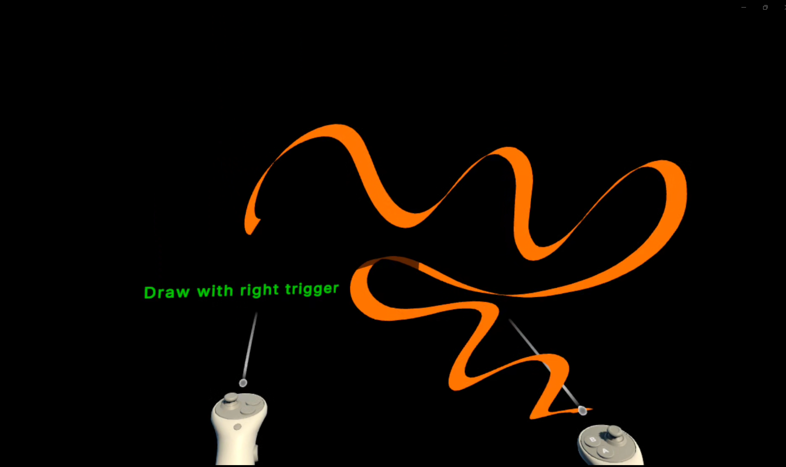
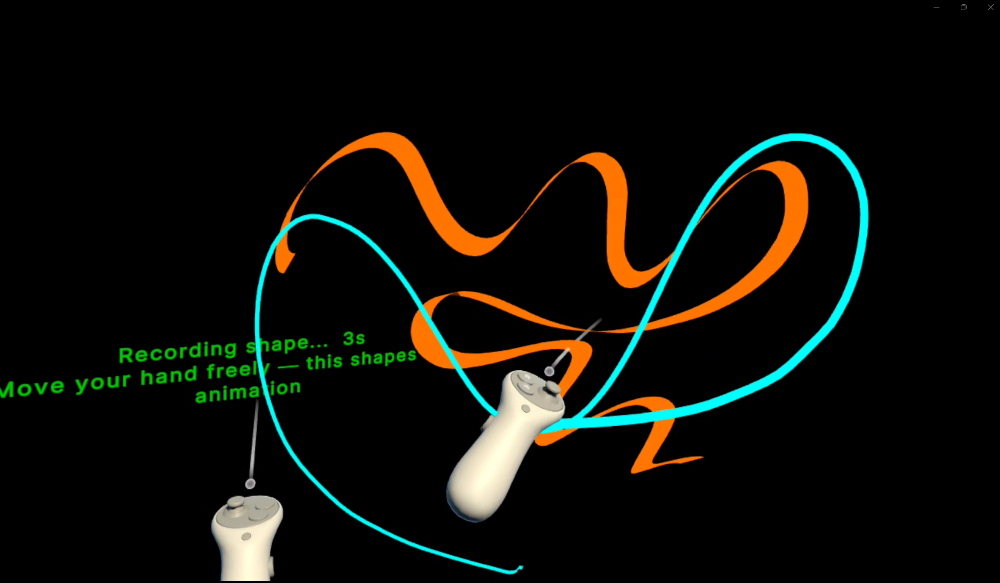

# Living Strokes
### Gesture-Driven Animation for Mixed Reality Drawing

A VR drawing tool built for Meta Quest 3 where the strokes you draw come alive through your own body movement.

---

## Overview

Most VR drawing tools treat a stroke as final the moment you lift your hand. Living Strokes treats it as a starting point.

After drawing a stroke, you perform a physical gesture with your arm. That movement gets recorded, processed, and embedded into the drawing. From that point on, the stroke animates continuously — looping your gesture forever. Every stroke in the scene holds a different movement from a different moment, all alive at the same time.

---

## Interaction Flow

1. **Draw** — hold the right trigger and move to create a ribbon stroke in space
2. **Confirm** — keep the stroke or erase and redraw
3. **Choose animation style** — Wave travels the gesture end to end, Pulse moves the whole stroke together
4. **Record your gesture** — 3 seconds with a colored trail showing your movement in real time
5. **Preview** — see the animation before committing, redo if it is not right
6. **Add rhythm** — optional second gesture that controls how fast the animation cycles
7. **Finish** — the stroke is permanently alive

---

## Technical Approach

The gesture recording pipeline strips out straight-line drift from the recorded arm path and normalizes the remaining deviation — leaving only the pure character of the movement. That shape gets baked into a GPU motion texture at runtime. A custom HLSL vertex shader samples that texture every frame and displaces the stroke's mesh vertices, producing smooth continuous animation with no CPU cost per frame.

The interaction system is built as a coroutine-based state machine with confirmation and preview steps at every stage, giving users full control over what gets committed to the scene.

Built on top of the CavePainting Lite codebase from UMN's IV/LAB.

---

## Stack

- Unity 6 (6000.3.6f1)
- Meta Quest 3 with MR passthrough
- XR Interaction Toolkit
- Custom HLSL vertex shader
- C# coroutine state machine

---

## Documentation

Full written report including project documentation, creative process, and reflections: [FinalReport.pdf](FinalReport.pdf)

---

*CSCI 8605 — 3D Drawing in Extended Reality, University of Minnesota*
